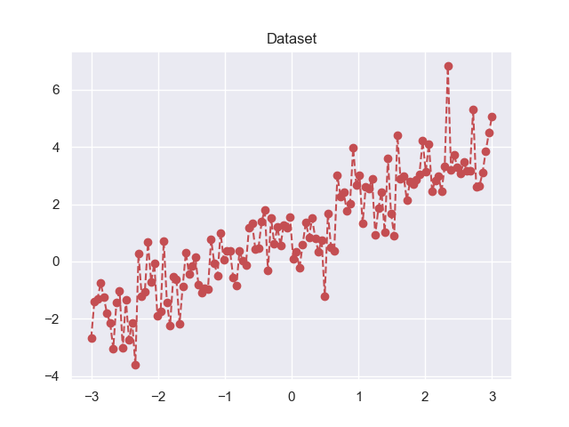
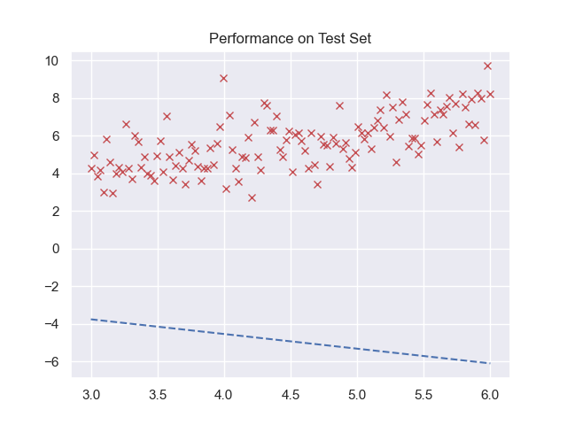
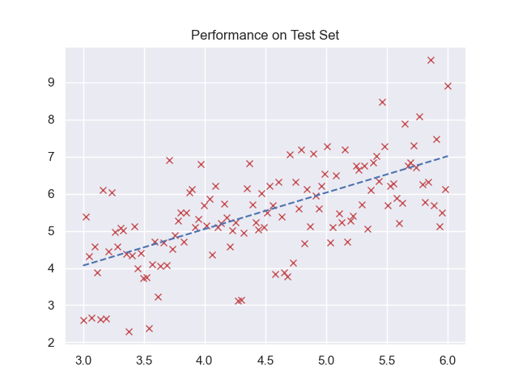

# Linear Regression

This is a tiny project that does linear regression using Pytorch. I've created a simple univariate dataset and trained a linear regression model to predict the output. The model is trained using gradient descent.

## Getting Started

### Prerequisites

You need to have Python 3.6+ installed on your system. You can download it from [here](https://www.python.org/downloads/). You can install the required packages using the following command:

```bash
pip install -r requirements.txt
```

### Running the code

To run the code, simply run the following command:

```bash
python mh_linear_regression.py
```

## Dataset

For the dataset I've created a simple univariate dataset. Each data point is a tuple of (x, y) where x is the input and y is the output. It's an addition of a line and a sine wave with some noise. The dataset looks like this:



## Model

The model is a simple linear regression model. I haven't used any torch layers. I've just used a single weight and bias variables for educational purposes :)

## Results

Here's the plot of the model's prediction on the test set before training:



And here's the plot after training for 20 epochs:


