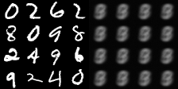
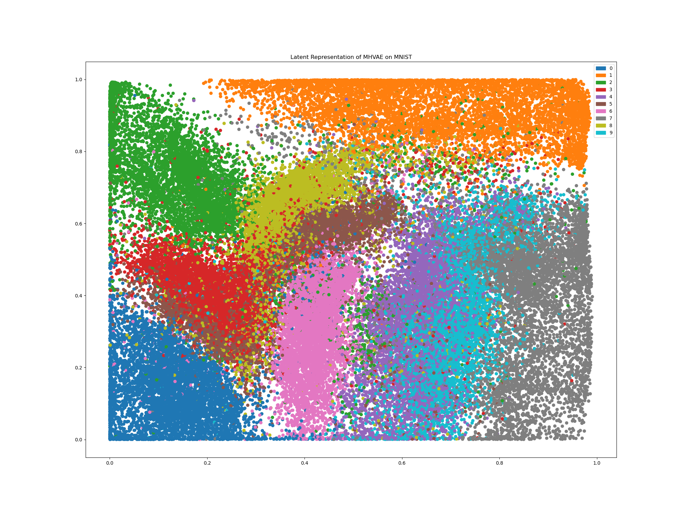

# Easy-to-Use Variational Autoencoder (VAE) in Tensorflow 2.0



This is a simple implementation of a Variational Autoencoder (VAE) in Tensorflow 2.0. It's meant to be easy to use and easy to understand. I've tried to keep the code as simple as possible. I've also added a lot of comments to make it easier to understand. Using this code you can train a VAE on your own dataset in just a few lines of code.

### Example

```python
from tensorflow.keras.datasets.mnist import load_data
from mh_vae import MHVAE

##  Load MNIST dataset...
(X, _), (_, _) = load_data()
X = X.reshape(-1, 784) / 255.
##  Create and train VAE...
vae = MHVAE(input_dim=(784,), latent_dim=20, regularization_const=10000)
vae.compile(optimizer='adam')
vae.fit(X, epochs=10, batch_size=64)
vae.save_weights('vae_weights_20d.h5')
```

## Getting Started

By default, _MHVAE_ can use its own encoder and decoder (MLPs). It is also possible to use your own encoder and decoder. To use your own encoder and decoder, you need to pass them to the constructor of _MHVAE_ as follows:

```python
model = MHVAE(input_dim=(28, 28, 1), latent_dim=20, model_p=model_p, model_q=model_q)
```

A simple example is implemented in `train_custom.py`.

## Latent Space Representation

As a funny exploration, I've trained a VAE with 2-dimensional latent space on the MNIST dataset. Here's a visualization of the latent space:


